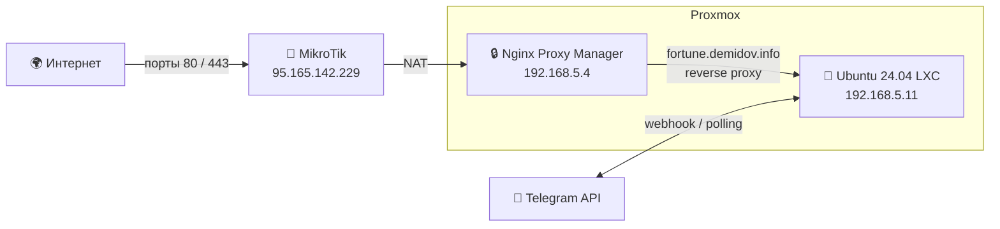
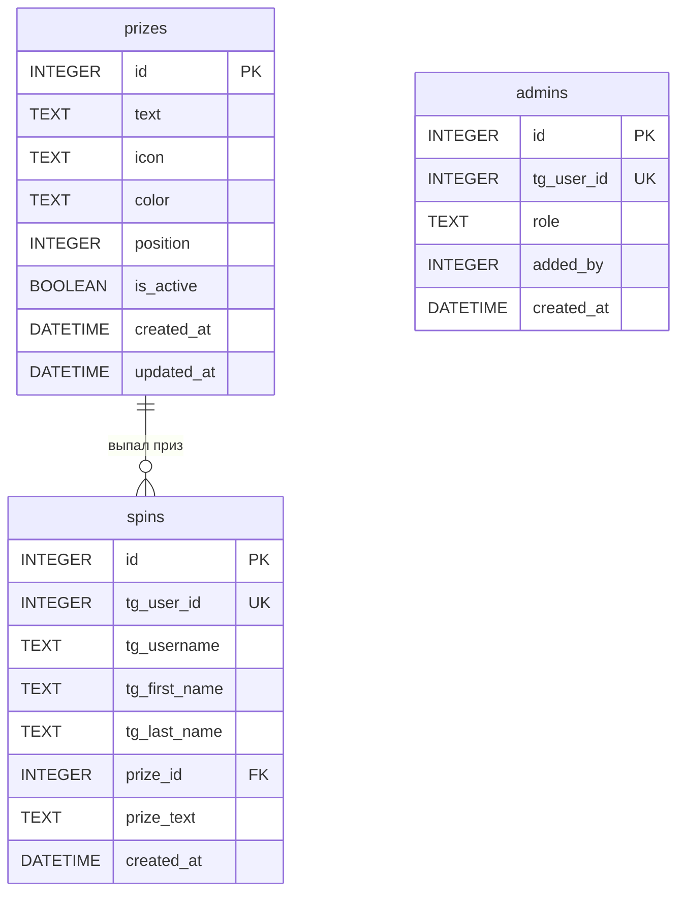

# 🎰 Колесо Фортуны — ЦБ МО

<p align="center">
  
</p>

<p align="center">
  
  
  
  
  
  
  
  
  
  
</p>

Telegram Mini App — интерактивное «Колесо Фортуны» для сотрудников ЦБ МО (Центрального Бюджетного Управления Московской Области) к празднику 23 Февраля.

- 🔗 Telegram Mini App: [@fortune_cbmo_bot](https://t.me/fortune_cbmo_bot)
- 🌐 Домен: [fortune.demidov.info](https://fortune.demidov.info)

> **Проект долгосрочный** — рассчитан на ежегодное использование с полным управлением призами, сбросом и перенастройкой через веб-админку.

---

## 📖 Описание

Telegram Mini App, в котором сотрудники крутят колесо фортуны и получают гарантированный подарок — один из бонусов к рабочему графику. Результат можно показать руководителю и воспользоваться подарком в любой рабочий день до 23 февраля следующего года. Telegram-бот служит точкой входа для запуска Mini App.

---

## 🎁 Призы (секторы колеса)

Призы настраиваются динамически через веб-админку. Набор по умолчанию:

| № | Приз | Иконка | Цвет |
|:-:|------|:------:|------|
| 1 | 3-часовой перерыв на обед | 🍽️ | `#4A90D9` |
| 2 | День отдыха в ваш ДР (до/после, если ДР выпадает на выходной) | 🎂 | `#E8734A` |
| 3 | Завершение работы на 2 часа раньше | ⏰ | `#F5C242` |
| 4 | Дополнительный выходной | 🌴 | `#D95B5B` |
| 5 | Начало работы на 2 часа позже | 😴 | `#5BBD8C` |
| 6 | Завершение работы в обед (в 14:00) | 🏠 | `#9B6EC5` |

> Вероятности: все секторы равновероятны.

---

## 📐 Техническое задание

### Основная механика

1. Пользователь открывает бота в Telegram → нажимает кнопку → открывается Mini App с колесом.
2. Колесо строится динамически по данным из API (`GET /api/prizes`).
3. Нажимает «Испытай удачу!» → колесо крутится с анимацией → выпадает приз.
4. Показывается модальное окно с поздравлением и названием приза.
5. После закрытия модалки отображается результат — какой приз выпал.

### Количество попыток

- **Одна попытка** на пользователя до полного сброса.
- Если пользователь уже крутил — отображается сообщение «Вы уже испытали удачу» и его приз.
- Повторное вращение доступно **только после полного сброса** через админку.

### Срок действия приза

- Подарком можно воспользоваться в любой рабочий день до 23 февраля следующего года.
- Сотрудник показывает результат (скриншот из Mini App) своему руководителю и согласовывает дату/время.

### Логирование результатов

Обязательное сохранение в БД:

- Telegram User ID
- Username (`@username`)
- Имя и фамилия из Telegram-профиля
- Выпавший приз (номер и текст)
- Дата и время вращения

### Авторизация

- **Нет белого списка** сотрудников — доступ через ссылку на бота.
- Ссылку получат только сотрудники через внутренние каналы.
- Идентификация пользователя через Telegram WebApp `initData`.

---

## 🔧 Веб-админка

Отдельная веб-страница (`/admin`), доступ по Telegram-авторизации.

### Роли

| Роль | Возможности |
|------|-------------|
| **Админ** | Полный доступ: управление призами, результатами, пользователями, сброс |
| **Просмотрщик** | Только просмотр результатов |

### Управление призами

- ➕ Добавить приз (текст, иконка-эмодзи, цвет)
- ✏️ Редактировать существующий приз
- 🗑️ Удалить приз
- 🔀 Менять порядок секторов (drag & drop)
- 👁️ Предпросмотр колеса с текущими настройками
- Поддержка от 2 до 12 секторов

### Управление результатами

- 📊 Таблица результатов (кто, что, когда, Telegram-данные)
- 🔍 Поиск и фильтрация
- 🗑️ Удаление отдельных записей
- 🔄 Полный сброс базы (все пользователи могут крутить заново)
- 📥 Экспорт результатов в CSV

### Управление доступом

- 👤 Добавление / удаление админов (по Telegram ID)
- 👁️ Добавление / удаление просмотрщиков (по Telegram ID)
- 📋 Список текущих админов и просмотрщиков

---

## 🎨 Дизайн колеса

- Тёмный фон с мерцающими звёздами
- Колесо с цветными секторами, номера в белых кружках
- Красная окантовка с мигающими лампочками (бегущий огонь)
- Золотой центральный хаб
- Золотая стрелка-указатель сверху (остриё к центру)
- Легенда с расшифровкой номеров под колесом
- Конфетти при выигрыше
- Адаптивный дизайн под мобильные устройства
- Колесо строится динамически — количество секторов, цвета и тексты загружаются из API

---

## 🌐 Инфраструктура

### Сетевая схема



### Серверные данные

| Параметр | Значение |
|----------|----------|
| Домен | `fortune.demidov.info` |
| Внешний IP | `95.165.142.229` |
| Роутер | MikroTik (NAT: порты 80, 443) |
| Reverse Proxy | Nginx Proxy Manager (`192.168.5.4`) |
| Сервер приложения | Ubuntu 24.04 LXC (`192.168.5.11`) |
| SSL | Let's Encrypt (через Nginx Proxy Manager) |
| Docker | 28.2.2 + Compose 2.37.1 |
| Пользователь ОС | `wobujidao` |

### Настройка Nginx Proxy Manager

| Параметр | Значение |
|----------|----------|
| Domain | `fortune.demidov.info` |
| Scheme | `http` |
| Forward IP | `192.168.5.11` |
| Forward Port | `8000` |
| SSL | Let's Encrypt |
| Websockets | включено |

---

## 🏗️ Архитектура

### Стек технологий

| Компонент | Технология |
|-----------|-----------|
| Frontend | HTML5 + CSS3 + JavaScript (Canvas API) |
| Backend | Python 3.13+ |
| Telegram Bot | aiogram 3.x |
| API | FastAPI + Pydantic v2 |
| БД | SQLite + aiosqlite + SQLAlchemy 2.0 (async) |
| Web-сервер | Nginx (reverse proxy + SSL + статика) |
| Деплой | Docker + Docker Compose |
| Авторизация | Telegram WebApp initData (HMAC-SHA256) |
| Линтер | Ruff |
| Типизация | Полная аннотация типов |

### Структура проекта

```
fortune-wheel/
├── docker-compose.yml
├── .env                        # Переменные окружения (не в git)
├── .env.example                # Шаблон переменных
├── .gitignore
├── README.md
│
├── assets/
│   ├── bot-avatar.svg          # Аватарка бота (исходник)
│   └── bot-avatar.png          # Аватарка бота (для BotFather)
│
├── frontend/
│   ├── index.html              # Mini App — колесо фортуны
│   └── admin.html              # Веб-админка
│
├── bot/
│   ├── __init__.py
│   ├── Dockerfile
│   ├── requirements.txt
│   ├── main.py                 # Точка входа: бот + FastAPI
│   ├── config.py               # Конфигурация из .env
│   ├── db/
│   │   ├── __init__.py
│   │   ├── database.py         # Подключение к SQLite, движок
│   │   └── models.py           # SQLAlchemy-модели (prizes, spins, admins)
│   ├── handlers/
│   │   ├── __init__.py
│   │   ├── start.py            # /start — приветствие + кнопка WebApp
│   │   └── admin.py            # Админ-команды бота
│   └── api/
│       ├── __init__.py
│       ├── routes.py           # FastAPI-эндпоинты
│       └── auth.py             # Валидация Telegram initData
│
└── nginx/
    ├── Dockerfile
    └── nginx.conf              # Конфиг Nginx
```

### Docker-контейнеры

| Контейнер | Описание | Порт |
|-----------|----------|------|
| `bot` | Python: aiogram 3 + FastAPI | 8000 (внутренний) |
| `nginx` | Reverse proxy + статика | 8000 → 80 (SSL на Nginx Proxy Manager) |

### Схема БД (SQLite)



### API-эндпоинты (FastAPI)

#### Публичные (Mini App)

| Метод | URL | Описание |
|:-----:|-----|----------|
| `GET` | `/api/prizes` | Список активных призов для колеса |
| `POST` | `/api/spin` | Крутить колесо — возвращает приз |
| `GET` | `/api/check/{tg_user_id}` | Проверить, крутил ли пользователь |

#### Админские (требуют авторизацию)

| Метод | URL | Описание |
|:-----:|-----|----------|
| `GET` | `/api/admin/results` | Все результаты вращений |
| `DELETE` | `/api/admin/results/{id}` | Удалить запись |
| `POST` | `/api/admin/reset` | Полный сброс результатов |
| `GET` | `/api/admin/export` | Экспорт результатов в CSV |
| `GET` | `/api/admin/prizes` | Все призы (включая неактивные) |
| `POST` | `/api/admin/prizes` | Добавить приз |
| `PUT` | `/api/admin/prizes/{id}` | Редактировать приз |
| `DELETE` | `/api/admin/prizes/{id}` | Удалить приз |
| `PUT` | `/api/admin/prizes/reorder` | Изменить порядок секторов |
| `GET` | `/api/admin/users` | Список админов и просмотрщиков |
| `POST` | `/api/admin/users` | Добавить админа / просмотрщика |
| `DELETE` | `/api/admin/users/{id}` | Удалить админа / просмотрщика |

> Все запросы валидируются через Telegram WebApp `initData` (HMAC-SHA256).

### Команды бота

| Команда | Доступ | Описание |
|---------|--------|----------|
| `/start` | Все | Приветствие + кнопка открытия Mini App |
| `/admin` | Админ | Ссылка на веб-админку |
| `/results` | Админ, Просмотрщик | Краткая сводка результатов |

---

## ⚙️ Переменные окружения

Файл `.env` (не попадает в git). Шаблон — `.env.example`.

```env
# Telegram
BOT_TOKEN=your_bot_token_here
WEBAPP_URL=https://fortune.demidov.info

# Начальные админы (Telegram ID через запятую)
ADMIN_IDS=123456789,987654321

# База данных
DB_PATH=./data/fortune.db

# Сервер
API_HOST=0.0.0.0
API_PORT=8000
```

---

## 🚀 Деплой

### Требования

- Docker + Docker Compose
- Домен с SSL-сертификатом (для Telegram Mini App обязателен HTTPS)
- Telegram Bot Token (через [@BotFather](https://t.me/BotFather))

### Запуск

```bash
git clone https://github.com/wobujidao/fortune-wheel.git
cd fortune-wheel
cp .env.example .env
mcedit .env                   # вписать токен бота, ID админов

docker compose up -d --build
```

### Обновление

```bash
cd fortune-wheel
git pull
docker compose up -d --build
```

---

## 📝 Текст рассылки (от кадровой службы)

> Уважаемые мужчины, в преддверии 23 Февраля подготовили для вас праздничное «Колесо Фортуны» 🔮
>
> Крутите колесо и забирайте гарантированные подарки в честь Дня защитника Отечества 🎁
>
> **Что можно выиграть?**
> - ▫️ Трёхчасовой обеденный перерыв
> - ▫️ День отдыха в ваш день рождения (до/после него, если ДР выпадает на выходной)
> - ▫️ Возможность завершить работу на два часа раньше
> - ▫️ Дополнительный выходной
> - ▫️ Возможность начать работу на два часа позже
> - ▫️ Завершение работы в обед (в 14:00)
>
> **Как принять участие?** Очень просто:
> - ✔️ Переходите по ссылке в чат-бот ЦБ МО «Колесо Фортуны»: https://t.me/fortune_cbmo_bot
> - ✔️ Доверьтесь судьбе
> - ✔️ Крутите колесо (каждый участник сможет всего один раз испытать удачу)
>
> **Что дальше?**
> Вы можете воспользоваться подарком в любой день до 23 февраля следующего года.
> Пожалуйста, заранее согласуйте дату/время со своим руководителем 😉
>
> Повезёт каждому 🤝 Мы точно знаем, что вам улыбнётся удача!
>
> Поздравляем всех с наступающим праздником!
> *Команда кадровой службы ЦБ* 💛

---

## 📌 Важные заметки

- Колесо приурочено к 23 Февраля — **только для мужчин**
- Один пользователь = одна попытка (до сброса)
- Приз действителен до 23 февраля следующего года; согласование с руководителем обязательно
- Название: «Колесо **Ф**ортуны» — Фортуны с большой буквы
- Проект рассчитан на ежегодное переиспользование — призы, цвета и тексты настраиваются через админку
